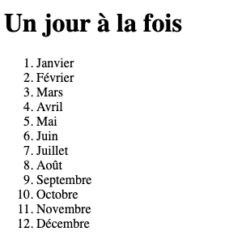
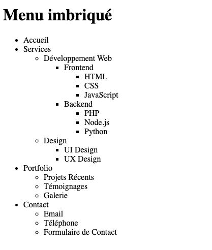
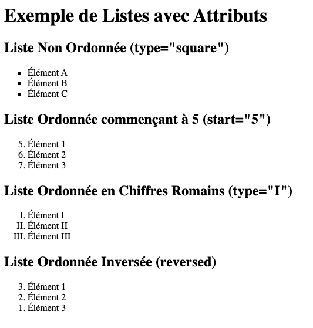
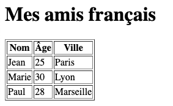
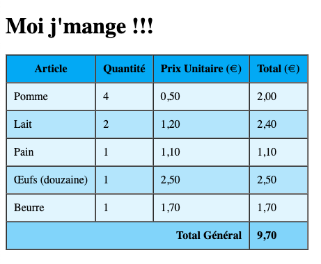

# Exercices 01

Dans le même répertoire de base tout au long du cours, exemple `0SU-WebClient1`, créez un sous-répertoire `Exercices01` et un nouveau fichier `.html` pour chacune des questions suivantes. Exemple: `question1.html`

## Question 01 - C'est un départ !

Dans un fichier nommé `question1.html` :

Créez la structure de base d'une page web et affichez `Bienvenue à tous` dans un texte de la plus grosse taille possible et fixez le texte de l'onglet du navigateur à `Question01`.

## Question 02 - Un jour à la fois

Créez la structure de base d'une page web, fixez le texte de l'onglet du navigateur à `Question02` et affichez ceci dans le navigateur en utilisant les balises appropriées :

## Question 03 - Menu imbriqué

Structurez le code de la question 3 comme précédemment et affichez ceci dans le navigateur en utilisant les balises appropriées :

## Question 04 - Exemple de Listes avec Attributs

Structurez le code de la question 4 comme précédemment et affichez ceci dans le navigateur en utilisant les balises appropriées :

## Question 05 - Mes amis français

Affichez ceci dans le navigateur en utilisant les balises appropriées :

ATTENTION: À partie de maintenant il est possible que VSCode identifie une partie du code comme `déprécié` et propose d'utiliser autre chose. Pour des raisons pédagogiques, nous allons ignorer ces avertissements pour l'instant.

## Question 06 - Moi j'mange !!!

Affichez ceci dans le navigateur en utilisant les balises appropriées :

## Question 07 - Je suis lié à vous

Affichez 2 lien cliquable vers un autre site web :

1. Un premier nommé `ICI` et remplaçant le contenu du site web actuel.
2. Un deuxième nommé `COMME AILLEURS` et ouvrant dans un nouvel onglet.

## Question 08 - DÉFI - Une photo au hasard

Affichez une photo au hasard dans le navigateur en utilisant les balises appropriées. La photo doit se changer automatiquement lorsque nous refraîchissons l'écran.

