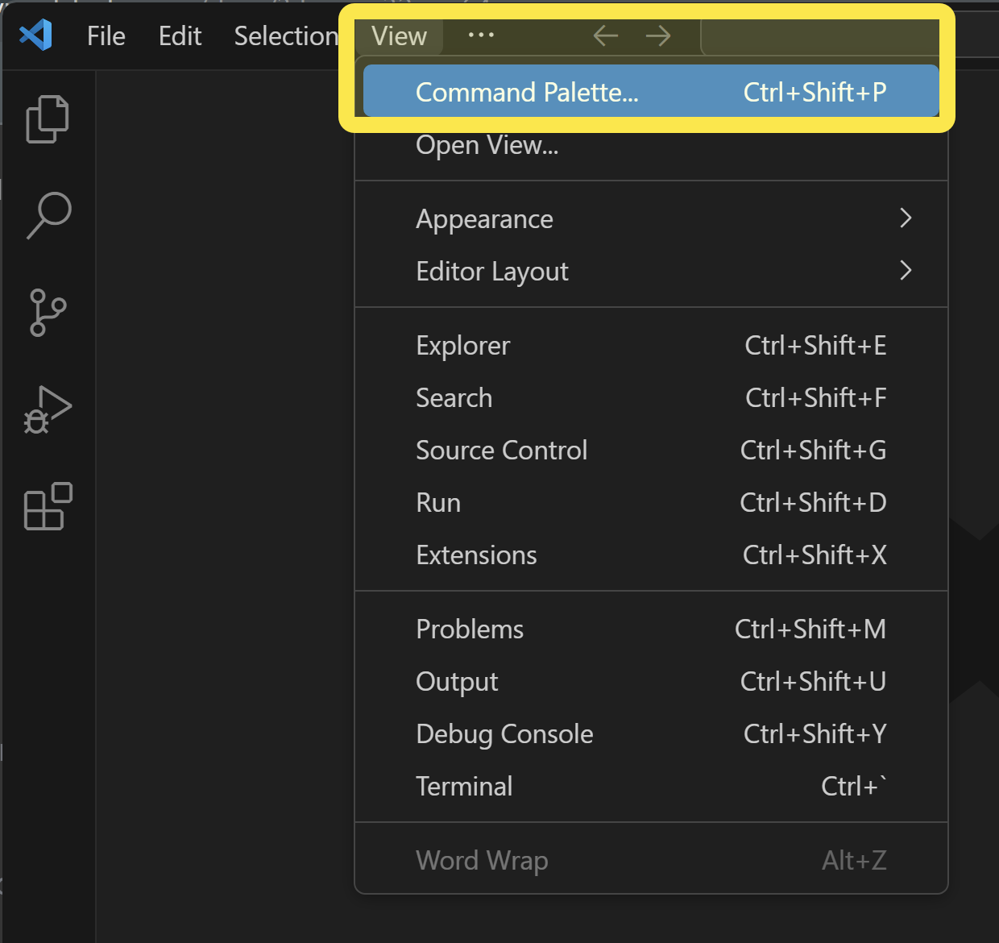
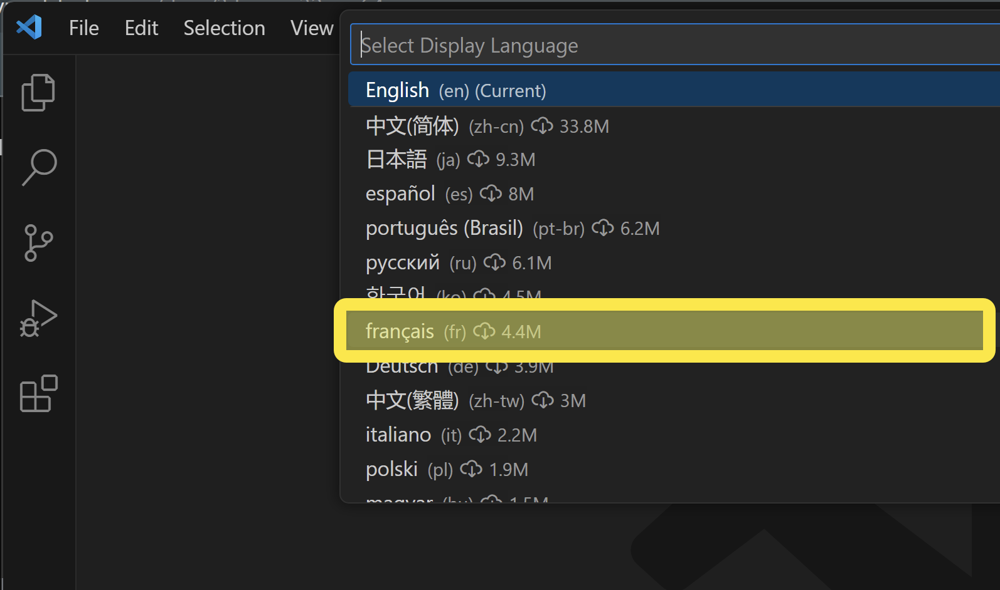
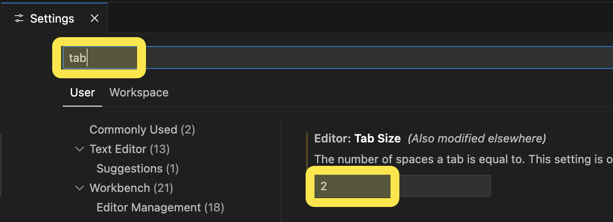

# Installation et configuration de VSCode

# 1 Installation

- Téléchargez et installez Visual Studio Code depuis le site officiel : [https://code.visualstudio.com/](https://code.visualstudio.com/)
- Sélectionnez le téléchargement selon votre système d'exploitation (ici Windows)
  

Microsoft vous demandera de lire l'accord de licence et d'accepter ces termes.

- Sélectionnez `Je comprends et j'Accepte les termes du contrat de licence` et appuyez sur `Suivant`.

Le logiciel d'installation vous offrira de sélectionner un emplacement d'installation des fichiers de VSCode.

- Laissez l'emplacement par défaut et appuyez sur `Suivant`.

Il vous sera possible maintenant de sélectionner (ou non) une entrée dans la barre du menu `Démarrer`.

- Laissez les informations par défaut et appuyez sur `Suivant`.

L'installateur vous proposera diverse façon d'ouvrir des projets en VSCode.

- Assurez-vous d'avoir sélectionné toutes les options et appuyez sur `Suivant`.

- Appuyez sur `Terminer` pour lancer VSCode.

- Une fois VSCode ouvert, fermez la fenêtre de configuration car nous le ferons étape par étape.
- Appuyez sur le `X` de la fenêtre `Welcome`

L'installation est maintenant `terminée`, place à la configuration !

# 2 Configuration

Dans cette section, nous allons configurer VSCode afin qu'il soit prêt pour du développement web.

## 2.1 Placer VSCode en français

Nous allons débuter par placer VSCode en français :

- Cliquez sur `View > Command Palette`.

- Tappez `display` dans le champ texte.
- Choisissez l'option `Configure display language`.
- 

- Sélectionnez `Français` dans la liste déroulante et appuyez sur `Restart`.
- 

## 2.2 Installation de Prettier

Prettier est un extension servant à structurer automatiquement l'emplacement du code afin de nous faire sauver beaucoup de temps.

- Cliquez sur le bouton des extensions.

- Tapper `prettier` dans le champ texte de recherche.
- Cliquez sur le bouton `Installer` de l'extension `Prettier - Code formatter`.

Prettier sera maintenant installé mais il faudra maintenant l'associer dans VSCode et le configurer dans les paramètres.

- Cliquez sur `Fichier > Préférences > Paramètres`.

- Tappez `format` dans le champ de recherche et sélectionnez `Prettier - Code formatter` dans la liste déroulante de `Default formatter`
- Cochez également `Format On Save` afin que le formatage ait lieu lors de la sauvegarde.

- Sélectionnez également l'enregistrement automatique dans le menu `Fichier`.

Voilà, Prettier est maintenant installé et le code HTML devrait se structuré automatiquement lors de la sauvegarde.

## 2.2 Installation de Live Server

Live Server est un serveur web local qui s'installera sur votre ordinateur et vous permettra de voir en temps réel le résultat du code HTML & CSS programmé.

- Cliquez sur le bouton des extensions.
- 

- Entrez `live server` dans le champ texte de recherche.
- Cliquez sur `Installer` de l'extension `Live Server` ayant le plus de téléchargements en date du jour (52.3 millions).

Live Server sera maintenant installé et il sera possible de lancer un site web directement en cliquant sur le bouton de droite de la souris sur un fichier HTML et en sélectionnant `Open with Live Server`.

## 2.2 Configuration de l'espacement d'indentation

Lorsque nous avons du code représentant un `enfant` du code `parent`, il y a indentation (retraît du code à droite) de 2 caractère afin de signifier que c'est du code `enfant`.

- Cliquez sur `Fichier > Préférences > Paramètres`.

- Tappez `tab` dans le champ de recherche de paramètres.
- Entrez le chiffre deux (`2`) dans le paramètre `Tab Size`.

Voilà, deux espaces seront maintenant créés lorsque vous appuyerez sur la touche `Tab` (tabulation).

Bravo ! Vous êtes maintenant prêt à utiliser VSCode pour faire du code HTML & CSS et présenter de belles pages web.

