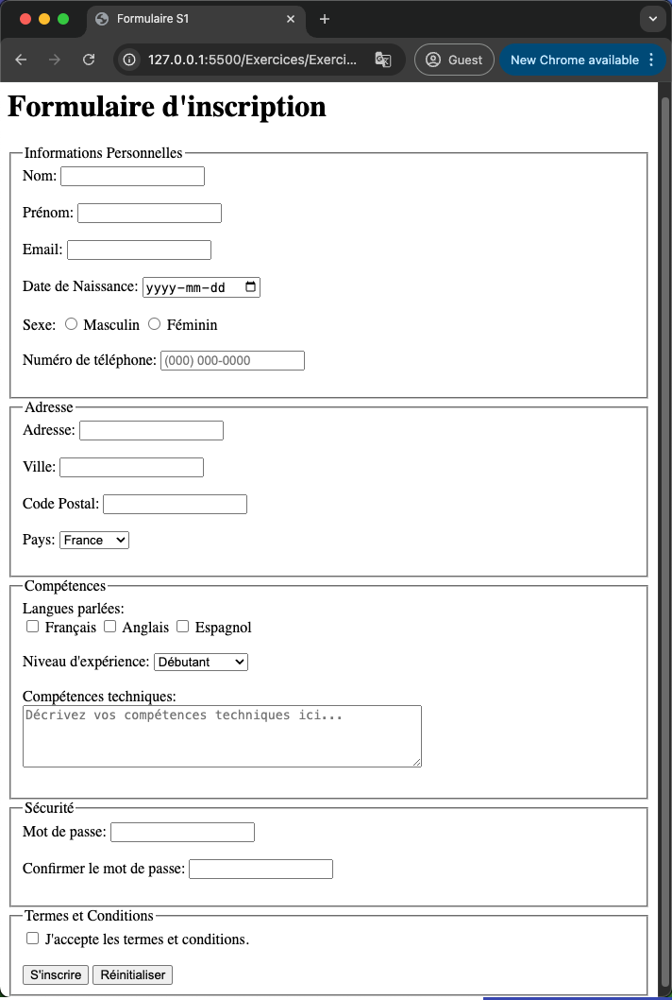
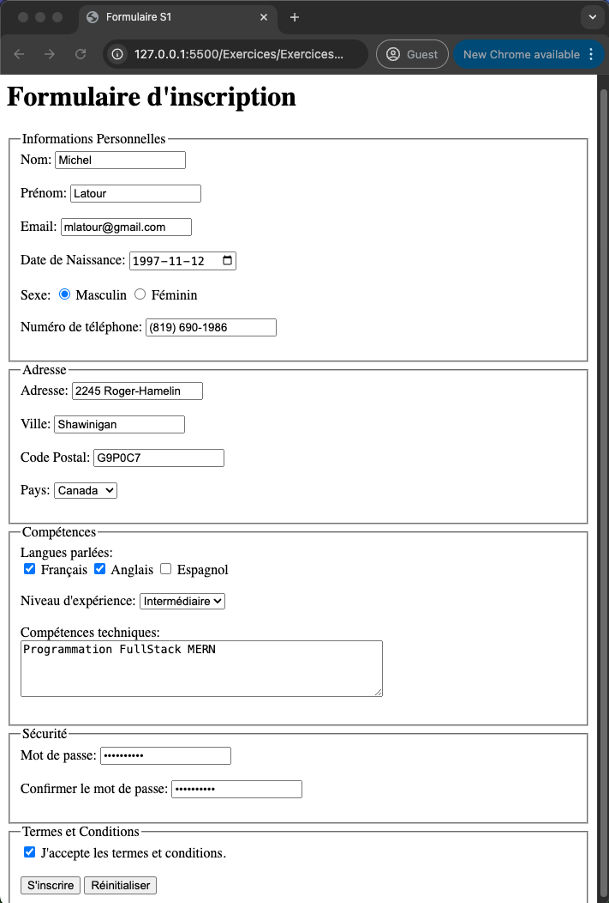

# Exercices 02

Dans le même répertoire de base tout au long du cours, exemple `0SU-WebClient1`, créez un sous-répertoire `Exercices02` et un nouveau fichier `.html` pour chacune des questions suivantes. Exemple: `question1.html`

## Question 1

Reproduisez simplement le formulaire suivant en permettant la sélection parmis 5 pays dans la liste des pays dont la valeur est un code spécifique. Voici le résultat attendu lorsqu'il est vide :

Voici le résultat attendu lorsqu'il est remplis :

