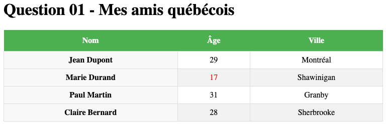
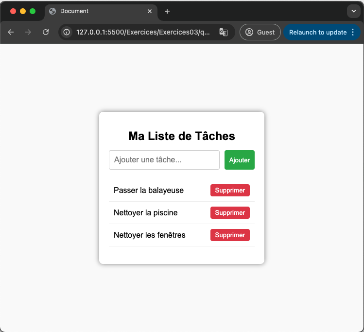
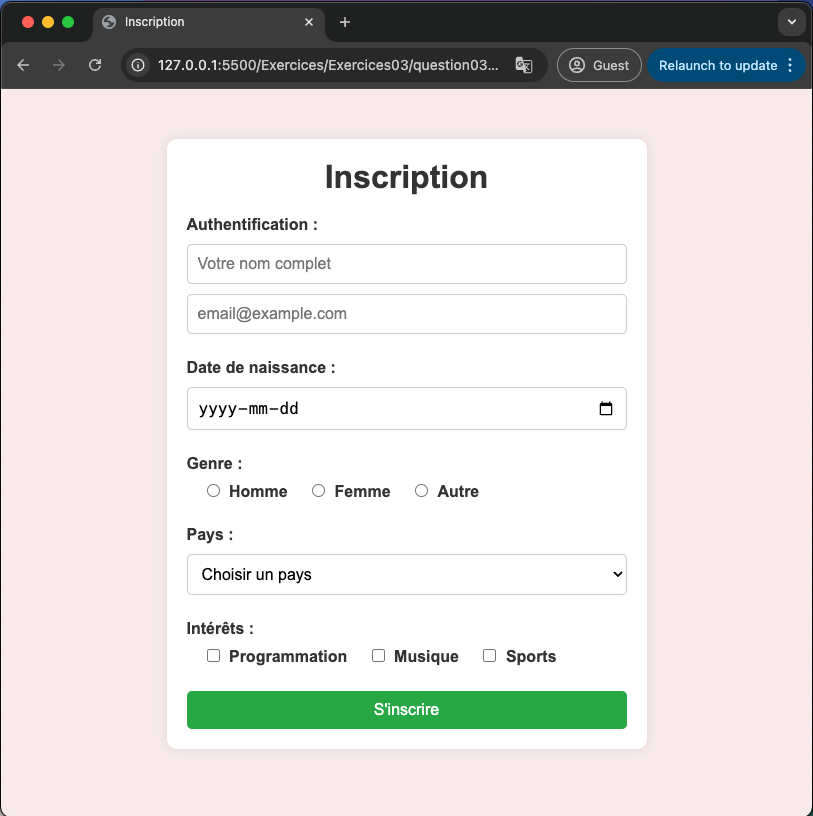
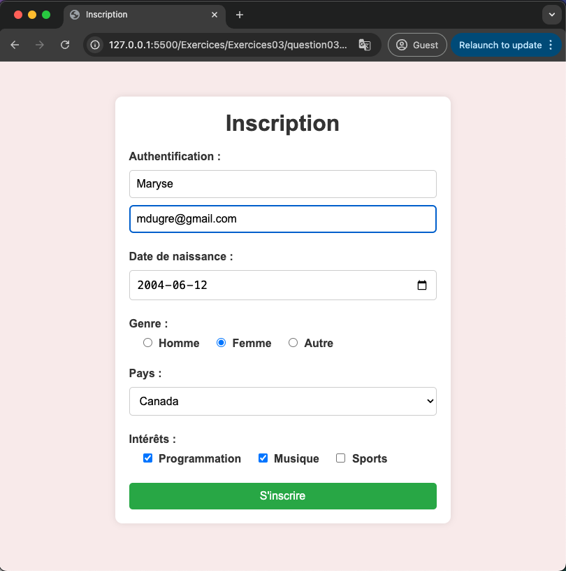

# Exercices 03

Dans le même répertoire de base tout au long du cours, exemple `0SU-WebClient1`, créez un sous-répertoire `Exercices03` et sous-répertoire par question `Question1` ainsi qu'un nouveau fichier `.html` pour chacune des questions suivantes. Exemple: `question1.html`.  Créer aussi le fichier `styles.css` dans le sous-répertoire `./public/css/`.

## Question 1 - Mes amis québécois
En utilisant tel quel le body du code HTML fournit en la plaçant au bon endroit dans votre page, créer un site web en complétant le code CSS présenté en partie.  Vous aller devoir renommer les sélecteur portant actuellement le nom de `sélecteur-ici` par le bon sélecteur afin d'obtenir le résultat suivant :


N.B. Il est normal que vous ne connaissiez pas encore l'ensemble des propriétés css utilisées dans cette question, c'est également le but de l'exercice de vous placer en contact avec les principales propriétés en mode pratique.
### Code HTML
```html
<table>
  <thead>
    <tr>
      <th>Nom</th>
      <th>Âge</th>
      <th>Ville</th>
    </tr>
  </thead>
  <tbody class="center">
    <tr>
      <td>Jean Dupont</td>
      <td>29</td>
      <td>Montréal</td>
    </tr>
    <tr>
      <td>Marie Durand</td>
      <td id="mineur">17</td>
      <td>Shawinigan</td>
    </tr>
    <tr>
      <td>Paul Martin</td>
      <td>31</td>
      <td>Granby</td>
    </tr>
    <tr>
      <td>Claire Bernard</td>
      <td>28</td>
      <td>Sherbrooke</td>
    </tr>
  </tbody>
</table>
```
### Code CSS (en partie)
```css
/* Style général pour le tableau */
sélecteur-ici {
  width: 100%;
  border-collapse: collapse; /* Fusionne les bordures entre les cellules */
}

/* Style des en-têtes du tableau */
sélecteur-ici {
  background-color: #4caf50;
  color: white;
  padding: 12px;
}

/* Style des cellules de données */
sélecteur-ici {
  border: 1px solid #ddd;
  padding: 8px;
}

/* Alignement du texte au centre pour le body */
sélecteur-ici {
  text-align: center;
}

/* Couleur rouge pour les mineurs */
sélecteur-ici {
  color: red;
}

/* Alternance des couleurs de lignes pour le tableau */
tr:nth-child(even) {
  background-color: #f2f2f2;
}

/* Couleur de survol */
tr:hover {
  background-color: #ddd;
}

/* Style des cellules de données en gras */
td:first-child {
  font-weight: bold;
}

/* Couleur pour la première colonne */
td:first-child {
  background-color: #f9f9f9;
}
```
## Question 2 - Ma liste de tâches
En se basant sur le CSS fournit en entier, créer le HTML d'une page web permettant d'obtenir ce résultat.  Ici il est demandé de ne pas utiliser de tableau mais une `div` avec une classe `container` associée qui contient 3 parties :
1. Le header incluant le `h1` du titre.
2. Un formulaire (`input` et `button`).
3. Une liste de tâches (`ul` / `li`).



N.B. Il est normal que vous ne connaissiez pas encore l'ensemble des propriétés css utilisées dans cette question, c'est également le but de l'exercice de vous placer en contact avec les principales propriétés en mode pratique.

### Code CSS à utiliser
```css
    /* Styles de base de l'ensemble de la page */
    body {
      font-family: Arial, sans-serif;
      background-color: #f9f9f9;
      margin: 0;
      padding: 0;
      display: flex;
      justify-content: center;
      align-items: center;
      height: 100vh;
    }

    /* Conteneur principal */
    .container {
      background-color: white;
      padding: 20px;
      border-radius: 8px;
      box-shadow: 0 0 10px rgba(0, 0, 0, 0.5);
      width: 300px;
    }

    /* Titre h1 */
    h1 {
      font-size: 1.5em;
      margin-bottom: 15px;
      text-align: center;
    }

    /* Formulaire */
    form {
      display: flex;
      margin-bottom: 20px;
    }

    /* Sélecteur d'id pour le champ d'entrée */
    #addInput {
      flex: 1;
      padding: 10px;
      border: 1px solid #ccc;
      border-radius: 4px;
      font-size: 16px;
    }

    /* Bouton Ajouter */
    #submit {
      padding: 10px;
      background-color: #28a745;
      color: white;
      border: none;
      border-radius: 4px;
      margin-left: 10px;
      cursor: pointer;
    }

    /* Style du bouton Ajouter au survol */
    #submit:hover {
      background-color: #218838;
    }

    /* Liste des tâches à afficher */
    ul {
      list-style-type: none;
      padding: 0;
    }

    /* Éléments de la liste */
    li {
      display: flex;
      justify-content: space-between;
      align-items: center;
      padding: 10px;
      border-bottom: 1px solid #eee;
    }

    /* Texte de la tâche */
    .task-text {
      font-size: 16px;
    }

    /* Bouton Supprimer */
    .delete {
      background-color: #dc3545;
      color: white;
      border: none;
      padding: 5px 10px;
      border-radius: 4px;
      cursor: pointer;
    }

    /* Style du bouton Supprimer au survol */
    .delete:hover {
      background-color: #c82333;
    }
```
## DÉFI - Question 3 - Inscription
Créer votre propre HTML afin de générer le formulaire stylisé en utilisant le CSS fournit :
1. Choisissez 5 pays au hasard pour la liste des pays.
2. On ne doit pas pouvoir choisir `Choisir un pays` une fois qu'un vrai pays a été sélectionné.
3. Tous les champs logiquement obligatoires doivent l'être.



### Formulaire valide


### Code CSS à utiliser
```css
/* On réinitialise le mode de calcul des boîtes, le padding et la marge */
* {
  margin: 0;
  padding: 0;
  box-sizing: border-box;
}

/* Style de base de la page */
body {
  font-family: "Arial", sans-serif;
  background-color: #f8eaea;
}

/* Conteneur général du formulaire */
.form-container {
  background-color: white;
  padding: 20px;
  border-radius: 10px;
  box-shadow: 0 0 10px rgba(0, 0, 0, 0.1);
  width: 480px;
  margin: 50px auto;
}

/* Titre du formulaire */
h1 {
  text-align: center;
  color: #333;
  margin-bottom: 20px;
}

/* Groupes de champs d'entrée */
.form-group {
  margin-bottom: 15px;
}

/* Labels présents dans le formulaire */
label {
  display: inline-block;
  margin-bottom: 10px;
  color: #333;
  font-weight: bold;
}

/* Champs de texte et autres inputs */
.field {
  width: 100%;
  padding: 10px;
  border: 1px solid #ccc;
  border-radius: 5px;
  font-size: 16px;
  margin-bottom: 10px;
}

/* Boutons radio et cases à cocher */
.case {
  margin-right: 5px;
  margin-left: 20px;
}

/* Bouton de soumission */
#submit {
  width: 100%;
  padding: 10px;
  background-color: #28a745;
  color: white;
  border: none;
  border-radius: 5px;
  cursor: pointer;
  font-size: 16px;
}

/* Survol du bouton de soumission */
#submit:hover {
  background-color: #218838;
}
```


<p align="Center"></p>
