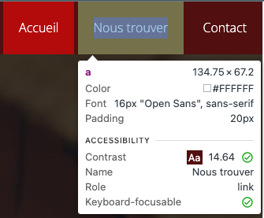
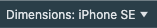
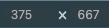
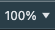
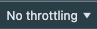
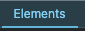
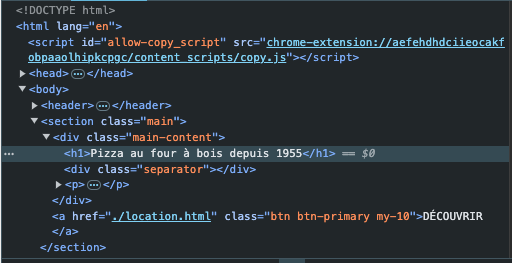
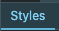
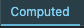
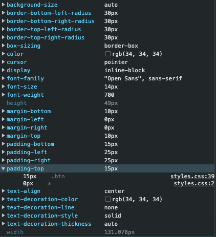

# Utilisation des Chrome DevTools
- Pour ouvrir les Chrome DevTools, appuyez sur le bouton de droite de la souris sur la page web désirée et choisissez, `Inspecter`.

## Selecteur d'élément

Permet de sélectionner un élment en cliquand dessus dans la page web afin de vérifier ses propriétés dans la fenêtre des `Éléments`.

Ici en cliquant sur le menu `Nous trouver` DevTools nous informe que ce menu est un élément de type `a` et affiche les principales propriétés.

Nous observons également que le padding de l'élément prend toute la place car l'élément est devenu verdâtre.  Il serait brun si c'était de la margin.

Le code correspondant sera alors sélectionné dans la section `Elements` et sera modifiable directement.

## Sélecteur de mode d'affichage

Permet de choisis sur quel type d'écran nous souhaitons tester le site web (ordinateur, iPhone, iPad, Samsung, etc...).

Une fois en mode `mobile`, un menu sera accessible en haut du site web :

### Choix de l'appareil

Choisissez dans cette liste le type d'appareil sur lequel vous souhaitez faire des tests.

### Nombre de pixel à l'écran

Il est possible de modifier manuellement le nombre de pixel du mode d'affichage sélectionné.  Nous ne modifierons rien dans cette section pour l'ensemble du cours.  Laisser la valeur par défaut.

### Zoom appliqué

Ici, pour des raisons de développement seulement, vous pouvez appliquer un Zoom à l'affichage afin d'agrandir le site web. Assurez-vous par contre de bien sélectionner 100% pour la version à remettre car c'est à 100% que sera corrigé tous les travaux.

### Fixer la qualité de connectivité

Pour des site plus poussés, il est possible de diminuer la qualité de connectivité simulée afin de s'assurer que le site fonctionne bien sur des réseaux plus lent (`Low-end mobile`).  Cela ne s'applique pas à ce cours comme nous ne faisons que du HTML et CSS dit `statique`. Laisser la valeur par défaut `No throttling`.

### Choisir l'orientation

Appuyez sur ce bouton pour placer la simulation en mode `paysage` et appuyez une autre fois pour revenir en mode `portrait`.

## Code du site

Permet de choisir d'afficher le **code du site web** de façon sélectionnable dans la première grande fenêtre de l'outil DevTools.

Cliquez sur l'élément à inspecter dans ce code et vous serez en mesure de voir le code CSS associé dans la section `Styles`.

Il est également possible de modifier directement le code **en mémoire du navigateur** en double-cliquant sur l'élément (ou l'attribut) à modifier et en entrant la valeur désirée.

## Liste des styles appliqués

Affichera, dans la deuxième grande fenêtre des DevTools, la liste des sélecteurs actifs ainsi que le CSS associé de l'élément sélectionné dans la section `Élements`.

## Ensemble des styles calculés

Affichera, dans la deuxième grande fenêtre des DevTools, la liste des propriétés et valeurs CSS calculées.  Ces valeurs représente celles réellement actives sur la page en cours tel que codées dans le fichier `styles.css`. Comme ces valeurs sont calculées, il n'est pas possible de les modifier.

Ici on observe que la propriété `padding-top` à reçu la valeur 0px dans le fichier `styles.css` à la ligne #2.