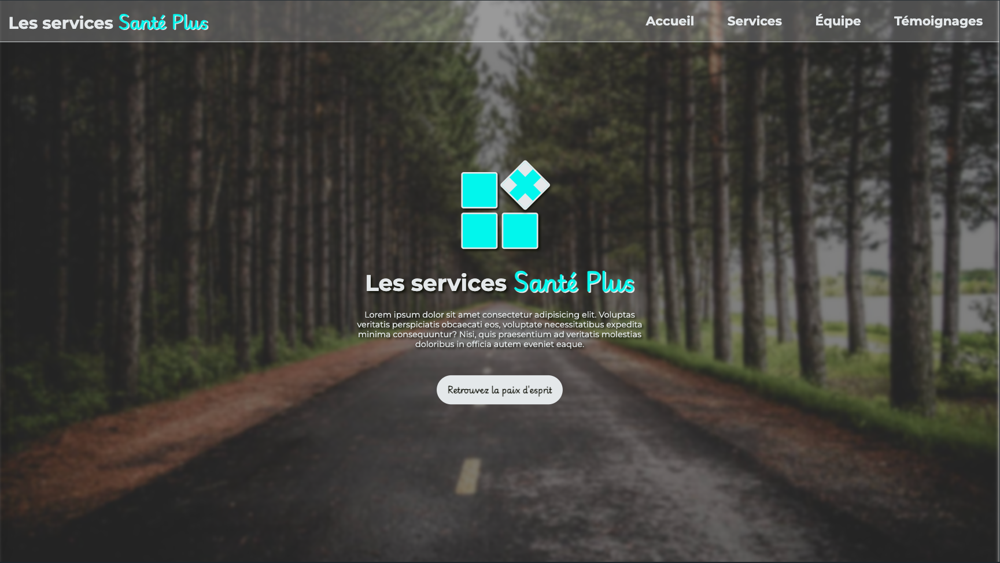
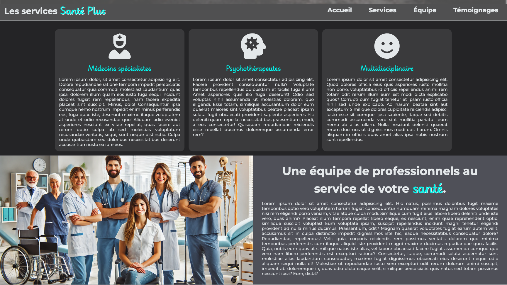

# Travail Pratique #2 - Santé Plus (version 0.4)
Votre travail pratique #2 sera de reproduire le plus fidèlement possible ce site web de regroupement de professionnels de la santé.

## Règles à suivre

1. La disposition des éléments doit obligatoirement être faite en `flex`. Aucun `flex` ni `grid` ne sera autorisé sous pénalité de deux points par présence.  

2. Le visuel doit être le plus identique possible lorsque vous placez le site en taille maximale HD (1920 pixels de large) et le site doit être adapté au web ainsi qu'à la taille du iPhone 14 Pro Max.

3. Vous devez utiliser les images [ICI](./_bin/images.zip). Il vous faudra cliquer sur `View raw`.

4. Vous devez obligatoirement utiliser la propriété-racourcis `background` pour fixer vos images de fond.

5. Chacune des sections du site doit être dans une balise `<section>` et contenir un ID portant le nom de la section.

6. Aucun `<br>` ne sera permis dans tout le site.

## Charte graphique
### Fonts
- Montserrat
- Playwrite
### Couleurs
- Texte primaire : `#e4e8ea`
- Texte secondaire : `#0f1108`
- Couleur d'accent : `#00f6ed`
- Arrière plan principal : `#242426`
- Arrière plan secondaire : `#4f5058`
### Logo central
- Le logo central devra être programmé en CSS en utilisant les `flex` ainsi que les transformation.
  - Taille de carrés: 5rem.
  - Classe responsable de tourner le carré + : 
    ```css
    .rotate {
      display: flex;
      position: relative;
      top: -10px;
      left: 10px;
      transform: rotate(45deg);
    }
    ```

## Page Accueil



## Sections services & équipe



## Section témoignages
à venir...

## Grille de correction
à venir...

<p align="Center"></p>
