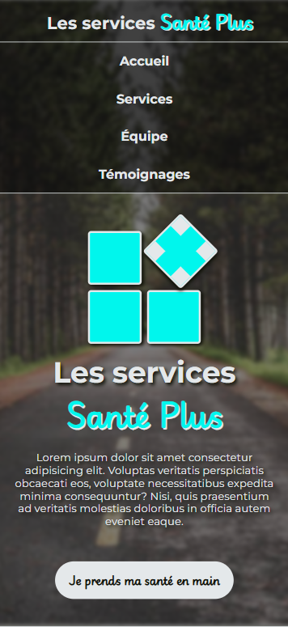
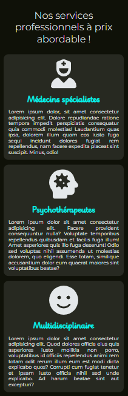
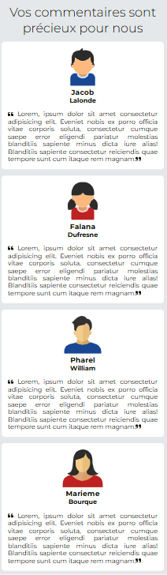
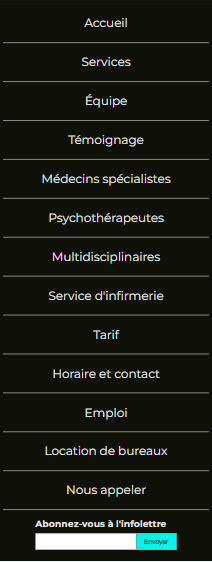

# Travail Pratique #2 - Santé Plus (version 1.0 finale)

Votre travail pratique #2 sera de reproduire le plus fidèlement possible ce site web de regroupement de professionnels de la santé.

## Règles à suivre

1. La disposition des éléments doit obligatoirement être faite en `flex` et en `grid` pour une partie du `footer`.

2. Le visuel doit être le plus identique possible lorsque vous placez le site en taille maximale HD (1920 pixels de large) et le site doit être adapté au web ainsi qu'à la taille du iPhone 14 Pro Max.

3. Vous devez utiliser les images [ICI](./_bin/images.zip). Il vous faudra cliquer sur `View raw`.

4. Vous devez obligatoirement utiliser la propriété-racourcis `background` pour fixer vos images de fond.

5. Chacune des sections du site doit être dans une balise `<section>` et contenir un ID portant le nom de la section.

6. Aucun `<br>` ne sera permis dans tout le site.

7. L'icône présent dans l'onglet doit être une version miniature du logo principal (`favicon.ico`). Une recherche sur le web sera probablement nécesaire.

## Charte graphique

### Fonts

- Montserrat
- Playwrite

### Variable

```css
:root {
  --color-primary: #e4e8ea;
  --color-secondary: #0f1108;
  --color-accent: #00f6ed;
  --color-background: #0f1108;
  --color-background-accent: #4f5058;
  --color-alpha1: rgba(255, 255, 255, 0.1);
  --color-alpha2: rgba(0, 0, 0, 0.5);
  --color-alpha3: rgba(0, 0, 0, 0.3);
  --shadow-main: 3px 3px 5px var(--color-secondary);
  --size-header-height: 5rem;
  --size-footer-height: 15rem;
}
```

### Logo central

- Le logo central devra être programmé en CSS en utilisant les `flex` ainsi que les transformation.
  - Taille de carrés: 5rem.
  - Classe responsable de tourner le carré + :
    ```css
    .rotate {
      display: flex;
      position: relative;
      top: -10px;
      left: 10px;
      transform: rotate(45deg);
    }
    ```

## Page Accueil


## Sections services & équipe


## Section témoignages


## Footer

La partie avec les 14 liens en texte blanc doit **obligatoirement** être programmée en utilisant une disposition en `grid`.


## Version mobile
Vous serez responsable de fournir une version mobile (iPhone 14 Pro Max) du site web en utilisant les spécifications apprises en classe.  La version mobile devra inclure tout les éléments de la page web régulière.

Voici un exemple de page responsive acceptable :


<p align="Center" style="margin:0"></p>
<p align="Center" style="margin:0"></p>
<p align="Center" style="margin:0"></p>
<p align="Center" style="margin:0"></p>
<p align="Center" style="margin:0"></p>

## Grille de correction

| #   | Élément                                                            | Points |
| --- | ------------------------------------------------------------------ | ------ |
| 01  | Utilisation juste des polices de caractères.                                             | 1    |
| 02  | Rassemblance de l'entête du site identique.                                       | 1   |
| 03  | Respect des hauteurs pour toutes les sections (100vh).                                          | 0.5   |
| 04  | Rassemblance de la page principale.                                  | 1   |
| 05  | Rassemblance de la section services.                                      | 1.5    |
| 06  | Rassemblance de la section équipe.                                           | 0.5   |
| 07  | Rassemblance de la section témoignages.                                      | 1      |
| 08  | Rassemblance du footer.                            | 1      |
| 09  | Logo identique et 100% en flex ou grid. | 1      |
| 10  | Tous les liens du footer sont dans une case de grille.                                  | 1      |
| 11  | Utilisation juste des variables.                 | 0.5      |
| 12  | Structure des répertoires conforme.                       | 1    |
| 13  | Respect des règles et conventions HTML & CSS.                      | 1    |
| 14  | Version mobile répond aux exigences expliquées en classe.                      | 3    |
| P  | Non-respect d'un élément de l'énoncé (par élément).                       | 0.5    |
| P  | Jours de retard.                       | 10%    |
|     |
|     | TOTAL                                                              | 15     |

<p align="Center"></p>
