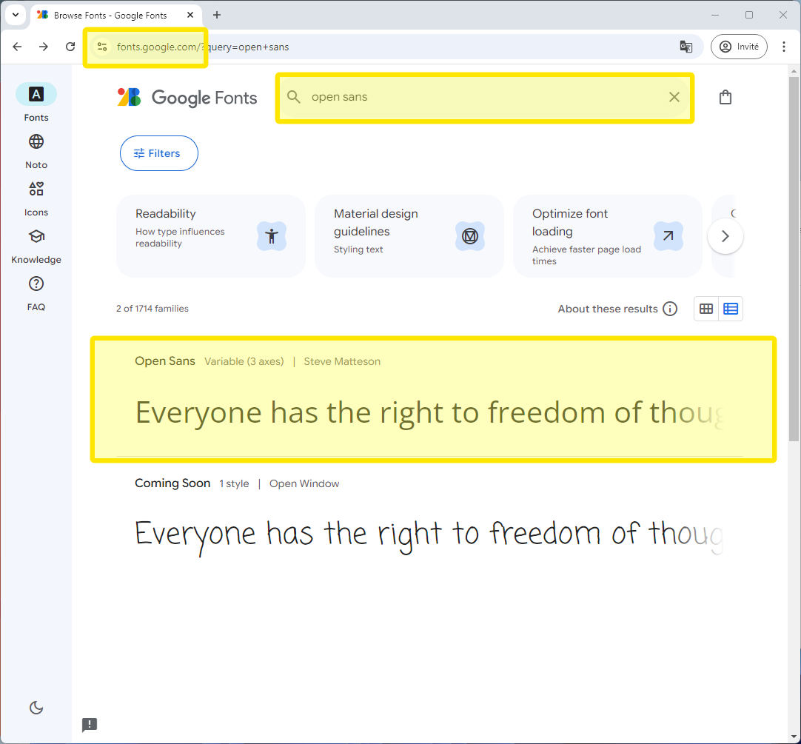
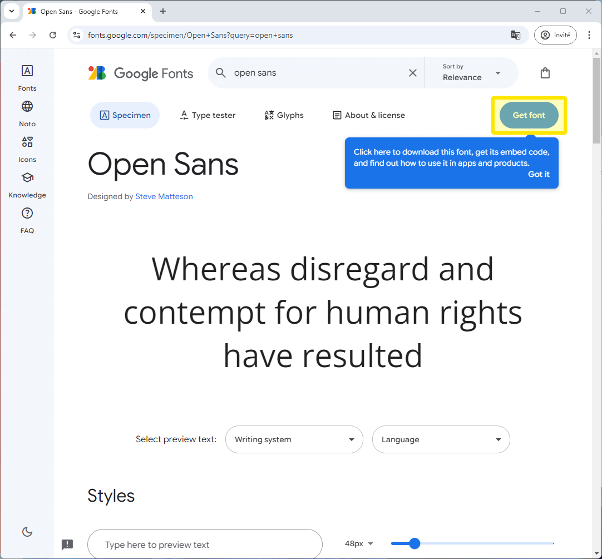
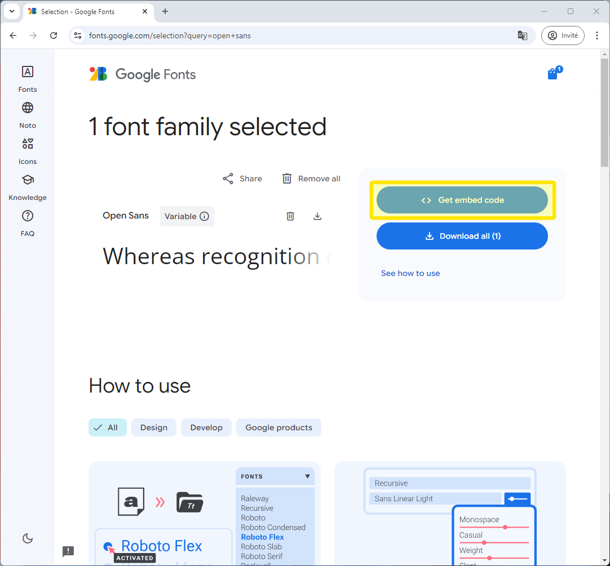
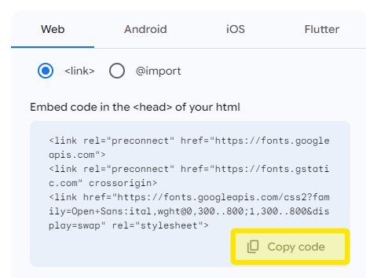

# Ajouter une police de caractère Google Font

## Ouvrir la page de Google Font

- Allez à l'adresse [Google Fonts](http://fonts.google.com) et entrez le nom du font désiré dans la barre de recherche. Pour le projet XPressPizza nous utiliserons le font `Open Sans`.
- Cliquez sur le bon font dans la liste en bas.
  

- Cliquez sur `Get Font`.

- Cliquez sur `Get embed code`.

- Dans la fenêtre de code présente sur la droite, cliquez sur `Copy code`.

- Collez ensuite ce code copié dans la section `<head>` de votre site web de travail pratique.

- Vous serez ensuite capable d'utiliser la propriété css `font-family: "Open Sans", sans-serif;`

