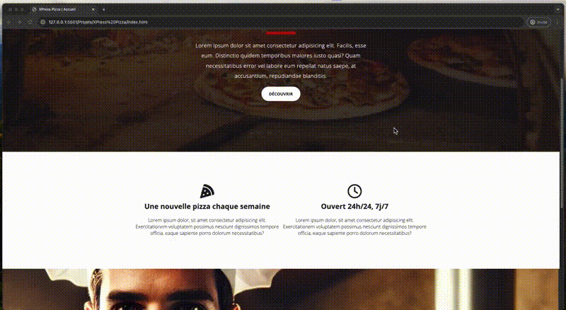
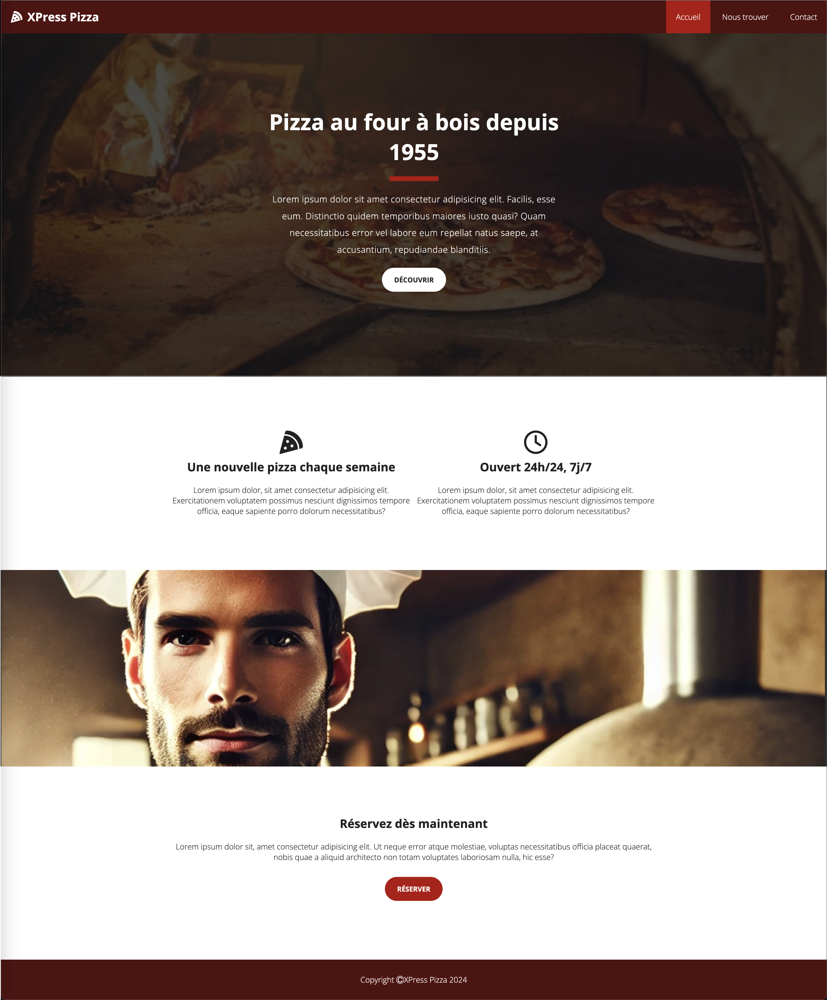
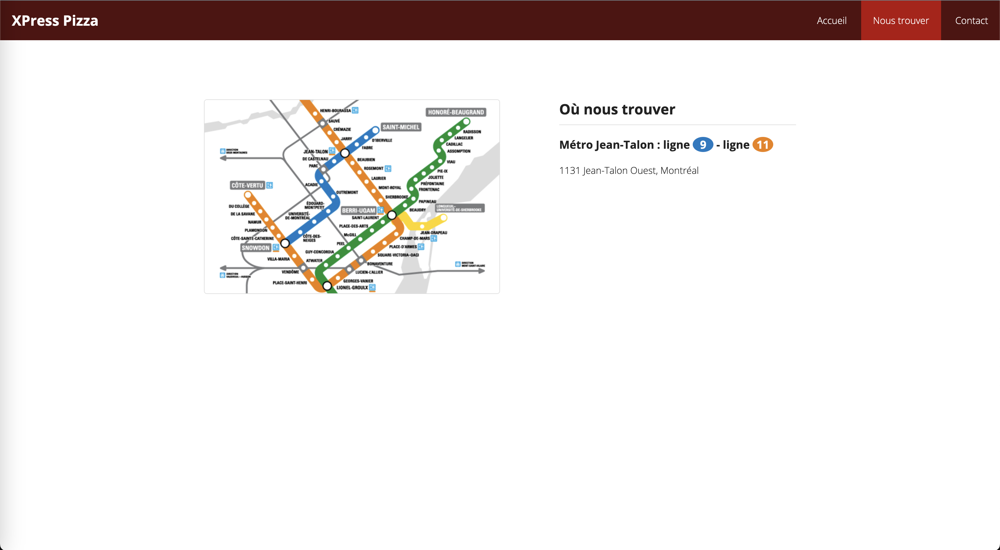
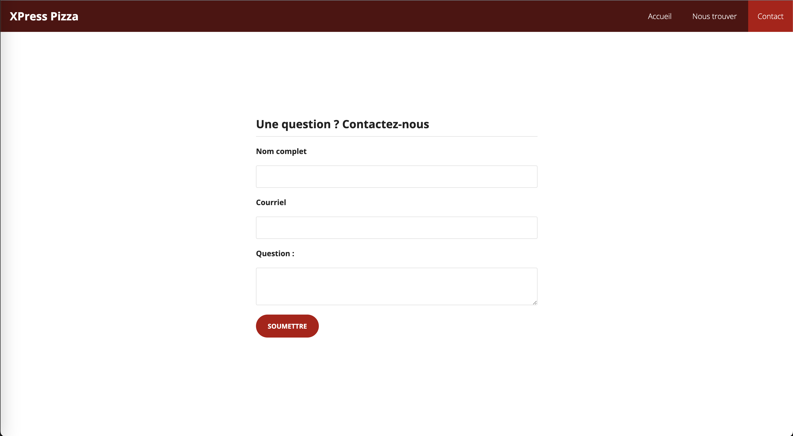

# Travail Pratique #1 - XPress Pizza

Votre travail pratique #1 sera de reproduire le plus fidèlement possible ce site web simple de 3 pages.

## Règles à suivre

1. Le visuel doit être le plus identique possible lorsque vous placez le site en taille maximale HD (1920 pixels de large).

2. Vous devez utiliser les images [ICI](./_bin/images.zip). Il vous faudra cliquer sur `View raw`.

3. La police de caractère utilisée est une police de Google Font nommée `Open Sans`. Vous trouverez une procédure détaillée pour l'utilisation d'une police de Google [ICI](./Theorie/GoogleFont.md).

4. Vous devez obligatoirement utiliser la propriété-racourcis `background` pour fixer vos images de fond.

5. Le formulaire doit envoyer les informations avec les nom de champs `name`, `email` & `message`.

6. Aucun `<br>` ne sera permis dans tout le site.

### Site Web Complet



## Page Accueil

Voici le visuel de la page `index.html`



### Structure de base à utiliser pour la page d'accueil

```html
<body>
  <header>
    <!-- Code de l'entête ici-->
    <nav>
      <!-- Menu de navigation -->
    </nav>
  </header>
  <section>
    <!-- Code de la partie principale ici -->
  </section>
  <section>
    <!-- Code de la section des informations ici -->
  </section>
  <section>
    <!-- Image du Pizaiolo ici -->
  </section>
  <section>
    <!-- Code de la section de réservation -->
  </section>
  <footer>
    <!-- Code de la section pied de page -->
  </footer>
</body>
```

## Page Nous trouver

Voici le visuel de la page `location.html`.



## Page Contact

Voici le visuel de la page `contact.html`.



## Grille de correction

| #   | Savings                                                            | Points |
| --- | ------------------------------------------------------------------ | ------ |
| 01  | Section Menu identique                                             | 0.5    |
| 02  | Section principale identique                                       | 0.75   |
| 03  | Section détails identique                                          | 0.75   |
| 04  | Section Section Pizaiolo identique                                 | 0.25   |
| 05  | Section réservation identique                                      | 0.5    |
| 06  | Section Footer identique                                           | 0.25   |
| 07  | Page "Nous Trouver" identique                                      | 1      |
| 08  | Page Contact identique et fonctionelle                             | 1      |
| 09  | Code CSS clairs et variables avec noms significatifs + conventions | 1      |
| 10  | Code CSS efficace et réutilisable                                  | 2      |
| 11  | HTML clair et conforme aux attentes et conventions                 | 1      |
| 12  | HTML Liste et types de sélecteurs convenables                      | 0.5    |
| 13  | Respect des consignes                                              | 1      |
|     |
|     | TOTAL                                                              | 10     |

<p align="Center"></p>
